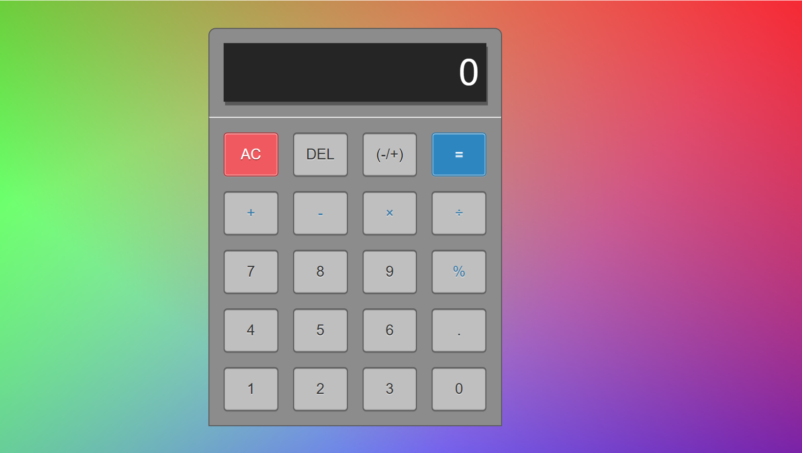

# jsCalc

This is a Javascript Calculator. It has javascript functionality built on a HTML and CSS base. 

This is live at:
https://dubhcait.github.io/jsCalc/

##This was a precourse Task for FAC:

Build a calculator. This is one of the "Advanced Front End Development Projects" on Free Code Camp.

Rather than using Codepen or JS Fiddle, you should do this directly with your text editor, terminal and browser. 
Start by creating your repo on GitHub and try to stick to the command line for adding, 
committing and pushing your changes as you go.

Make sure to host your project on GitHub pages. Remember, no frameworks

##JavaScript Calculator for freeCodeCamp Assignment
Build a JavaScript calculator. Use whichever libraries or APIs you need. Give it your own personal style.
Fulfill the below user stories:

- a user can add, subtract, multiply and divide two numbers
- a user can clear the input field with a clear button
- a user can keep chaining mathematical operations together 
- a user can only input one decimal point

## Made with
HTML, CSS, vanilla JavaScript

## Preview:

